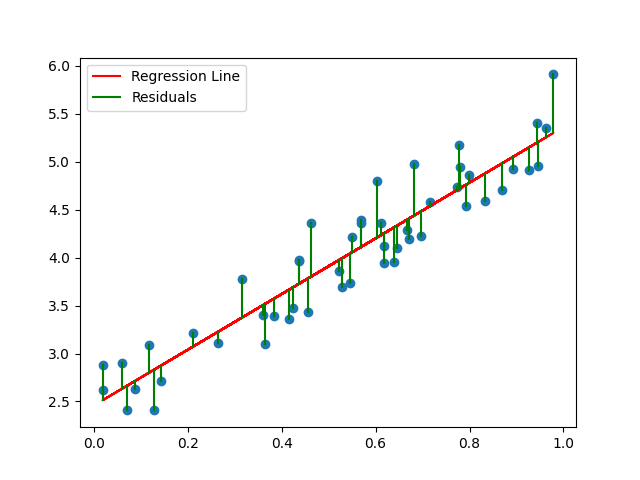

# Predicting the Punctuality of Montreal's Bus Network

## Overview

This repository contains assets related to the Program Comprehensive Assessment project (ESP) submitted to Ivan T. Ivanov for the Probability and Statistics 201-HTH-05 course. The project explores and applies multiple linear regression (MLR) techniques for constructing predictive models. In this repository, you will find Jupyter Notebooks that constitute the research, as well as their corresponding datasets and other related media assets. The project aims to predict the punctuality of buses in the STM network in the City of Montreal, employing a MLR model based on predetermined variables. Please refer to the following documentation for instructions on the use of this repository.

## Table of Contents

- [Getting Started](#getting-started)
- [Notebooks](#notebooks)
    - [0. Abstract](#0-abstract)
    - [1. Introduction](#1-introduction)
    - [2. Theory](#2-theory)
        - [2.1 Multiple Linear Regression](#21-multiple-linear-regression)
        - [2.2 Least Squares Estimation of the Parameters](#22-least-squares-estimation-of-the-parameters)
        - [2.3 Estimation of the Error Term](#23-estimation-of-the-error-term)
        - [2.4 Tests for the Significance of the Regression](#24-tests-for-the-significance-of-the-regression)
    - [3. Results](#3-results)
        - [3.1 Model Building with Weather](#31-model-building-with-weather)
        - [3.2 Model Building with Traffic](#32-model-building-with-traffic)
    - [4. Conclusions](#4-conclusions)
    - [5. References](#5-references)
    - [6. Appendices](#6-appendices)
        - [6.1 Appendix A: Data Preparation](#61-appendix-a-data-preparation)
            - [Appendix A.1: Bus Data](#appendix-a1-bus-data)
            - [Appendix A.2: Weather Data](#appendix-a2-weather-data)
            - [Appendix A.3: Traffic Data](#appendix-a3-traffic-data)
        - [6.2 Appendix B: Building the Model](#62-appendix-b-building-the-model)
            - [Appendix B.1: MLR With Weather](#appendix-b1-mlr-with-weather)
            - [Appendix B.2: MLR With Traffic](#appendix-b2-mlr-with-traffic)
- [Datasets](#datasets)
- [Media](#media)

## Getting Started
To explore this project, you can either:

1. **Read on GitHub:**  
    You can read the entire project on GitHub by navigating to the ["notebooks" section](#notebooks) or the ["notebooks" directory](/Notebooks/) clicking on the notebook you wish to view.

2. **Run Locally:**  
    This project was developed using Python 3.11.5 and Jupyter Notebook. If you don't have them installed, you can follow these guides: [Python](https://www.python.org/downloads/), [Jupyter](https://jupyter.org/install).

    > [!NOTE]
    > This project used the [Jupyter extension for Visual Studio Code](https://marketplace.visualstudio.com/items?itemName=ms-toolsai.jupyter), which handles the installation of Jupyter Notebook. If you are using Visual Studio Code, you can install this extension and open the notebooks directly from the editor. The appropriate Jupyter version is required for this extension to work. The version used in this project is listed in the requirements file (see below).

    To run this project locally, follow these steps:  


    It's recommended to create a virtual environment before proceeding:

    ```bash
    python3 -m venv env
    source env/bin/activate  # On Windows, use `env\Scripts\activate`
    ```

    Clone this repository:

    ```bash
    git clone https://github.com/FernandoG04/ProbStat-ESP--Bus-punctuality-predictor.git
    ```

    Install the dependencies:

    ```bash
    pip install -r requirements.txt
    ```

    Then, open the notebook you wish to run in the Jupyter Notebook interface in your browser.
    
## Notebooks

### [0. Abstract](/Notebooks/0_Abstract.ipynb)
This notebook provides an overview of the project.

### [1. Introduction](/Notebooks/1_Introduction.ipynb)
This notebook introduces the context and objectives of this project.

### 2. Theory
These notebooks introduce the theoretical background of the project.

- ### [2.1 Multiple Linear Regression](/Notebooks/2_1_Multiple_linear_regresion.ipynb)
- ### [2.2 Least Squares Estimation of the Parameters](/Notebooks/2_2_Least_square.ipynb)
- ### [2.3 Estimation of the Error Term](/Notebooks/2_3_Error_term.ipynb)
- ### [2.4 Tests for the Significance of the Regression](/Notebooks/2_4_Significance.ipynb)

### 3. Results
These notebooks present the results of the model building process.

- ### [3.1 Model Building with Weather](/Notebooks/3_1_MLR_bus_weather.ipynb)
- ### [3.2 Model Building with Traffic](/Notebooks/3_2_MLR_bus_traffic.ipynb)

### [4. Conclusions](/Notebooks/4_Conclusions.ipynb)
This notebook summarizes the findings of the project and provides conclusions.

### [5. References](/Notebooks/5_References.ipynb)
This notebook lists the references used in the project.

### 6. Appendices
These notebooks provide the code for the data preparation and the model building process.

- ### 6.1 Appendix A: Data Preparation
    - ### [Appendix A.1: Bus Data](/Notebooks/6_1_1_Bus.ipynb)
    - ### [Appendix A.2: Weather Data](/Notebooks/6_1_2_Weather.ipynb)
    - ### [Appendix A.3: Traffic Data](/Notebooks/6_1_3_Traffic.ipynb)

- ### 6.2 Appendix B: Building the Model
    - ### [Appendix B.1: MLR With Weather](/Notebooks/6_2_1_MLR_bus_weather.ipynb)
    - ### [Appendix B.2: MLR With Traffic](/Notebooks/6_2_2_MLR_bus_traffic.ipynb)

## Datasets

[Link to the datasets folder](/Data/Dataset_descriptions.md)  

## Media

[Link to the images folder](/Images/)

<p align="center">
    <br>
    <strong><em>Figure 2.2.1: Simple linear regression.</em></strong>
</p>

<p align="center">
    <br>
    <strong><em>Figure 2.2.2: Multiple linear regression with two predictors.</em></strong>
</p>

</td>
</tr>
</table>